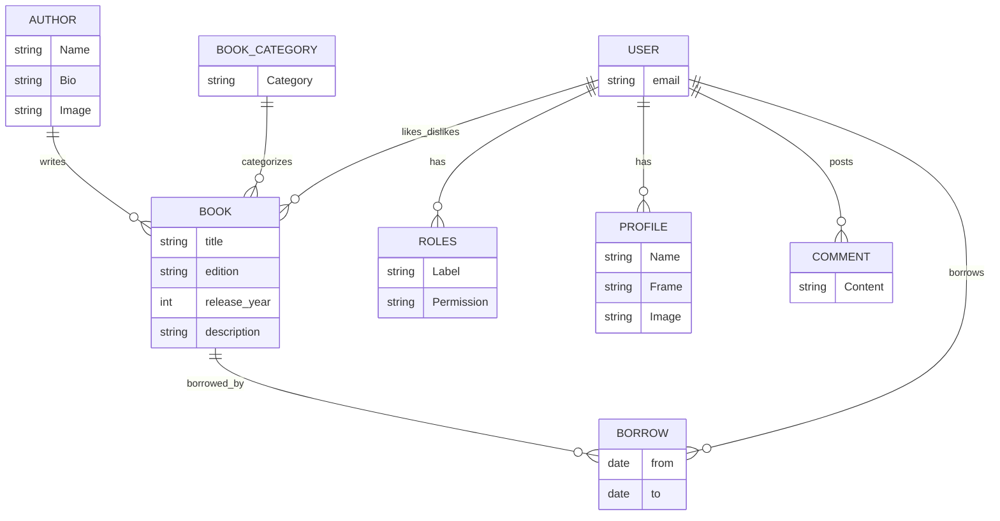

<!-- Install a "mermaid" plugin in your IDE to see this file correctly -->

```mermaid
erDiagram
    BOOK {
        string title
        string edition
        int release_year
        string description
    }
    AUTHOR {
        string Name
        string Bio
        string Image
    }
    BOOK_CATEGORY {
        string Category
    }
    BORROW {
        date from
        date to
    }
    USER {
        string email
    }
    ROLES {
        string Label
        string Permission
    }
    PROFILE {
        string Name
        string Frame
        string Image
    }
    COMMENT {
        string Content
    }

    AUTHOR ||--o{ BOOK : writes
    BOOK_CATEGORY ||--o{ BOOK : categorizes
    BOOK ||--o{ BORROW : borrowed_by
    USER ||--o{ BORROW : borrows
    USER ||--o{ COMMENT : posts
    USER ||--o{ PROFILE : has
    USER ||--o{ ROLES : has
    USER ||--o{ BOOK : likes_dislikes
```
